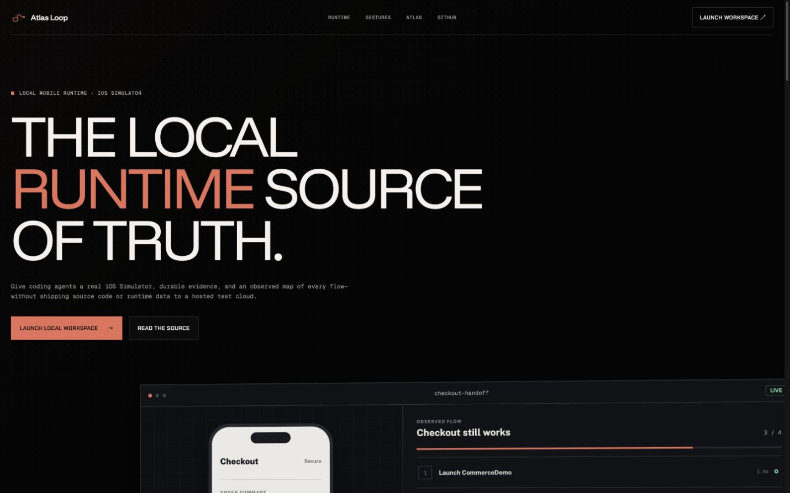

# Atlas Loop

**Runtime evidence for agents that touch real iOS interfaces.**

Atlas Loop drives real Simulator flows, records what the app showed after every action, and turns the run into inspectable local evidence. Screenshots, results, video markers, metrics, traces, and handoff commands stay on your Mac.



## Why Atlas Loop

Selector-heavy tests often fail when an interface is renamed or rearranged even though the user journey still works. Atlas Loop centers the observed flow instead: what action ran, what appeared on screen, what evidence was captured, and whether the outcome held.

- **Drive the Simulator** — build, install, launch, tap, type, swipe, edge-navigate, wait, and assert through CLI, MCP, or the live viewer.
- **Run and compose gesture sequences** — exercise pull-to-refresh, repeated scroll, edge-back, and carousel flows, or assemble a custom ordered flow from taps, swipes, waits, edge gestures, and checkpoints. Runs fail fast, can be cancelled, save evidence after every completed step, and can be kept in a browser-local flow library.
- **See the whole run** — follow the current screenshot, observed-flow verdict, timeline, action evidence, metrics, recording, and artifact health in one viewer.
- **Map real journeys** — derive screens and transitions from captured evidence, with deep links back to the producing session and action.
- **Hand work forward** — export verifiable local bundles and compact next-step commands for another human or coding agent.
- **Keep evidence local** — the daemon binds to loopback and the source of truth is `artifacts/sessions/<session-id>/`.

## Quick start

Requirements: macOS, Node.js 20.19+, Xcode command-line tools, Swift, and an iOS Simulator.

```bash
npm install
npm run typecheck
npm test
```

Run the local services in separate terminals:

```bash
# Terminal 1 — evidence daemon
npm run daemon -- --port 4317

# Terminal 2 — landing page and evidence viewer
npm run viewer

# Terminal 3 — verify the setup and begin a run
npm run cli -- doctor
npm run cli -- session start --simulator "iPhone 16" --viewer
```

The root URL is the product landing page. Viewer deep links such as `/?sessionId=latest`, `?actionId=...`, and `?artifactId=...` continue directly into runtime evidence.

The viewer can also create a session without leaving the workspace. Choose the Simulator input backend, provide an installed app bundle ID, and Atlas Loop creates the session, launches the app, and follows the new evidence stream. The bundled demo defaults to `app.atlasloop.CommerceDemo`; replace it for your own installed app. Press <kbd>⌘K</kbd> or <kbd>Ctrl K</kbd> to search workspace destinations.

## A minimal observed flow

```bash
npm run cli -- build --session latest \
  --project apps/ios-commerce-demo/CommerceDemo.xcodeproj \
  --scheme CommerceDemo
npm run cli -- install --session latest --app <path-to-built-app>
npm run cli -- launch --session latest --bundle-id app.atlasloop.CommerceDemo
npm run cli -- tap-element --session latest --id cart.continue
npm run cli -- assert-visible --session latest --id confirmation --screen
npm run cli -- session ready --session latest
```

Element commands use accessibility-visible identifiers and labels with bounded polling; coordinate actions remain available when the flow requires them. The selected input backend is always recorded with the evidence.

## What is included

| Surface | Purpose |
| --- | --- |
| Local daemon | Session lifecycle, app operations, input, screenshots, recordings, metrics, and evidence routes |
| CLI | Operator-friendly access to every runtime and export command |
| MCP server | Structured tools for coding agents using the same local controls |
| React viewer | Session launcher, command search, live device image, reusable gesture sequences, observed-flow summary, timeline, evidence inspection, Atlas map, visual diffs, and handoff UI |
| Native helper | Repo-owned NDJSON action protocol with `xcuitest` and visible-window `cgevent` backends |
| Commerce demo | Deterministic SwiftUI app for end-to-end Simulator verification |

Atlas Loop is intentionally local-first and macOS/iOS-Simulator scoped. It does not require a hosted backend, authentication service, or third-party test platform at runtime.

## Evidence and handoff

```bash
# Inspect health before trusting a run
npm run cli -- artifacts health --session latest
npm run cli -- session ready --session latest

# Produce human- and agent-readable evidence
npm run cli -- evidence report --session latest --format html \
  --out artifacts/reports/latest.html
npm run cli -- session handoff --session latest \
  --bundle artifacts/handoffs/latest
npm run cli -- handoff verify --bundle artifacts/handoffs/latest
```

Handoff bundles include JSON and Markdown summaries, raw events, optional reports, and a manifest with SHA-256 and size checks. They are local directories, not cloud share links or signed provenance claims.

## Documentation

- [Verification and smoke tests](docs/verification.md)
- [Daemon API](docs/daemon-api.md)
- [Artifact format](docs/artifact-format.md)
- [Handoff workflow](docs/handoff-workflow.md)
- [Native input helper](docs/native-hid-helper.md)
- [Protocol](docs/protocol.md)
- [Objective and scope](docs/objective-function.md)

## Development

```bash
npm run typecheck
npm run test:viewer
npm test
npm run build
npm run verify:artifacts
```

Apache-2.0
