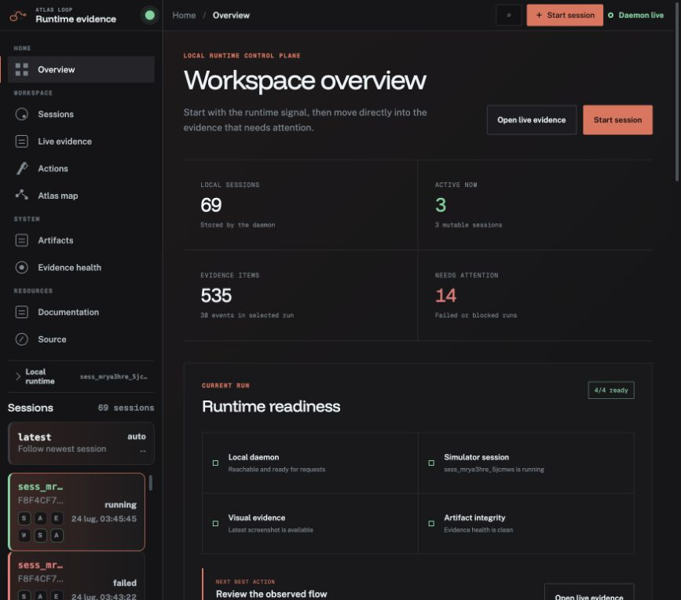
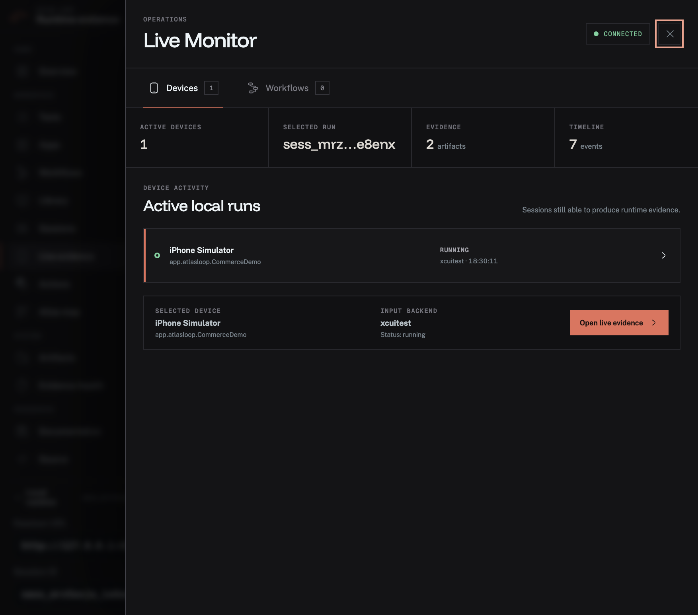
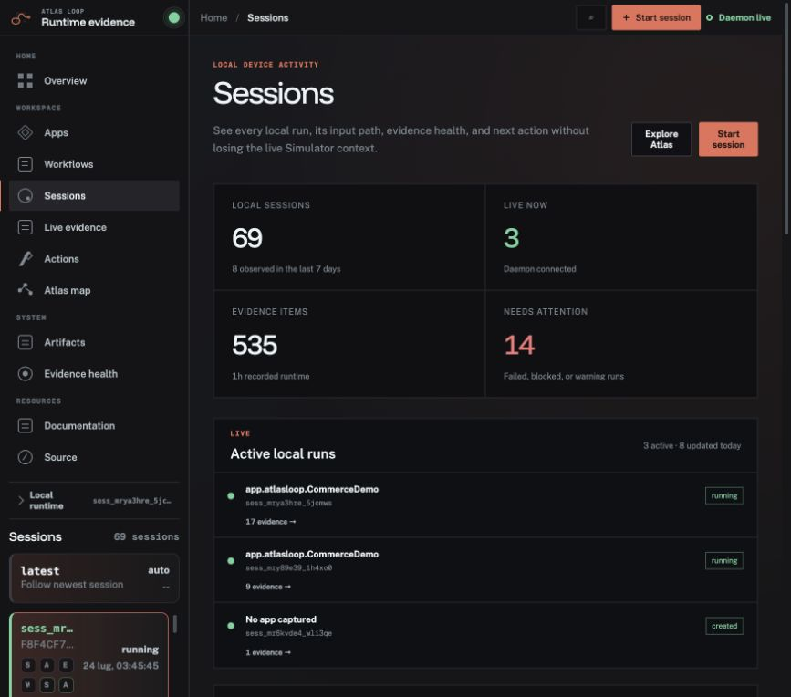
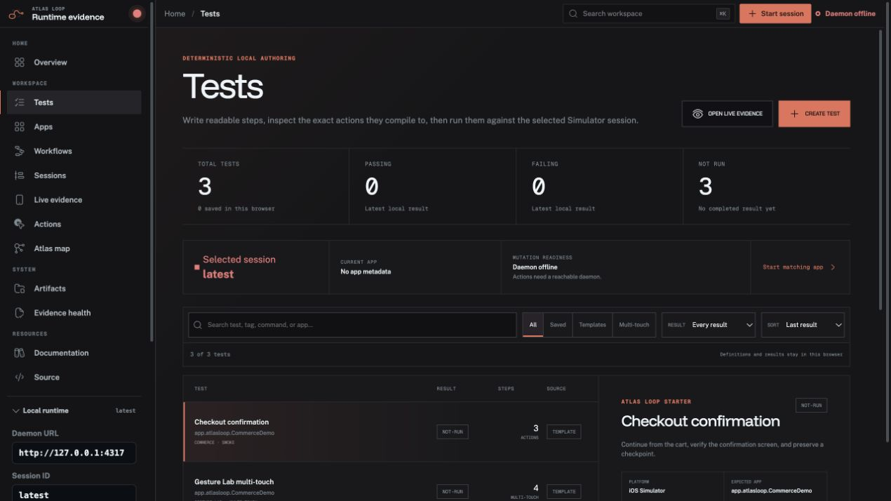
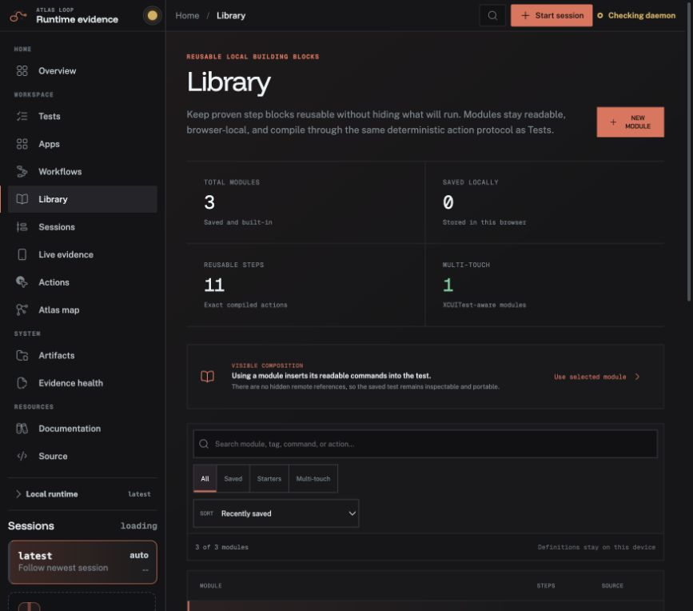
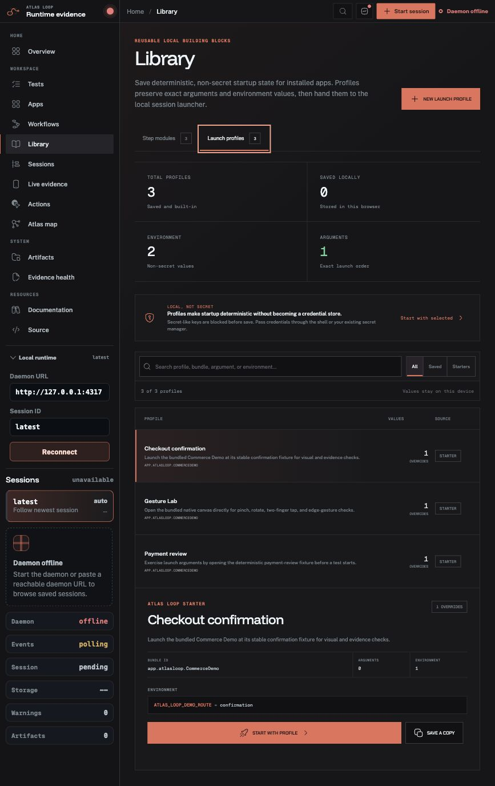
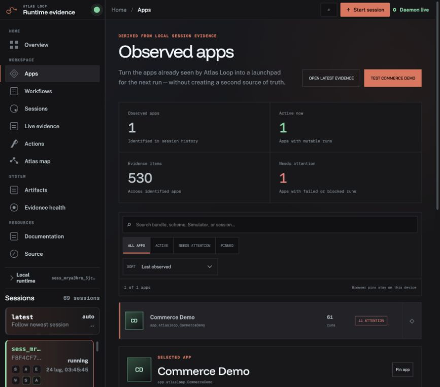
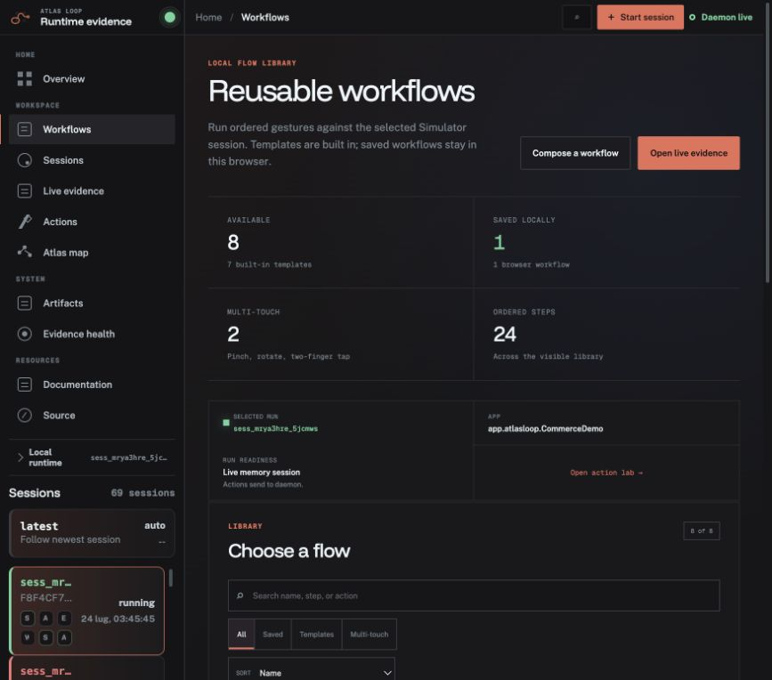
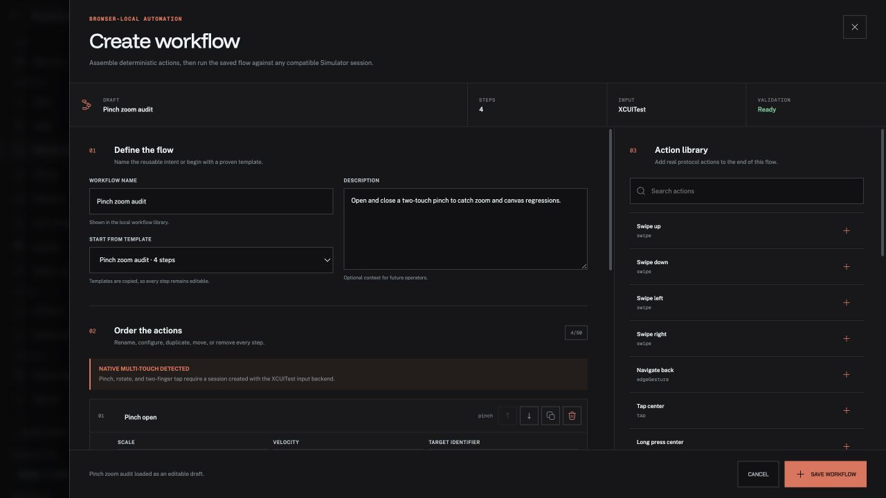

# Atlas Loop

**Runtime evidence for agents that touch real iOS interfaces.**

Atlas Loop drives real Simulator flows, records what the app showed after every action, and turns the run into inspectable local evidence. Screenshots, results, video markers, metrics, traces, and handoff commands stay on your Mac.


## Why Atlas Loop

Selector-heavy tests often fail when an interface is renamed or rearranged even though the user journey still works. Atlas Loop centers the observed flow instead: what action ran, what appeared on screen, what evidence was captured, and whether the outcome held.

- **Drive the Simulator** — build, install, deterministically relaunch, tap, type, swipe, edge-navigate, long-press, pinch, rotate, two-finger tap, wait, and assert through CLI, MCP, or the live viewer.
- **Author readable local tests** — write one deterministic command per line, inspect the exact action payload before execution, and keep the latest result beside the definition. Unsupported lines report their source number, an optional bundle guard blocks wrong-app runs, and saved definitions are recompiled at the storage boundary instead of trusting edited browser data.
- **Compose visible step modules** — reuse built-in or browser-saved command blocks without introducing hidden runtime references. A module previews its exact actions, then copies its readable source into the test so the resulting definition stays inspectable, editable, and portable.
- **Launch deterministic app states** — save reusable launch profiles beside step modules, then start an installed app with exact ordered arguments and non-secret environment values. Profiles are revalidated when loaded, malformed records are ignored, and secret-like or prototype-polluting keys are rejected before anything reaches browser storage.
- **Build and run gesture workflows** — create a validated flow directly inside the workflow library, starting blank or from pull-to-refresh, repeated scroll, edge-back, carousel, pinch-zoom, rotation, and press-context templates. Every action remains editable, accessibility targets are checked before save, multi-touch requirements stay visible, and execution fails fast while writing completed steps to evidence.
- **Relaunch observed apps** — turn bundle IDs, schemes, and `.app` paths already present in local session evidence into a searchable app catalog. Atlas Loop conservatively reconciles older path-only runs with a unique bundle-backed identity, surfaces failed or blocked histories, keeps optional pins in the browser, and prefills the next Simulator session without inventing a hosted registry.
- **Triage every local session** — use a dedicated run control plane for live activity, failures, evidence totals, duration, Simulator context, and the recorded XCUITest or Core Graphics input path. Search, filter, sort, inspect, and repeat a captured app without waiting for hosted state to synchronize.
- **Monitor live work globally** — open a non-navigating operations layer from any viewer workspace to see genuinely mutable devices, selected-run evidence, and current workflow progress. Hydrated disk sessions are never mislabeled as live, and loading, disconnected, unavailable, empty, active, and terminal workflow states each keep an honest next action visible.
- **See the whole workspace** — start from a locally-derived overview of active runs, failure signals, evidence totals, and readiness. A selected-device cockpit keeps the real Simulator, observed app, runtime, input backend, and next actions in one place; failed or blocked runs become a triage queue, while search, status scopes, sorting, and incremental history keep large local stores usable.
- **Map real journeys** — derive screens and transitions from captured evidence, with deep links back to the producing session and action.
- **Hand work forward** — export verifiable local bundles and compact next-step commands for another human or coding agent.
- **Keep evidence local** — the daemon binds to loopback and the source of truth is `artifacts/sessions/<session-id>/`.

## Quick start

Requirements: macOS, Node.js 20.19+, Xcode command-line tools, Swift, and an iOS Simulator.

```bash
npm install
npm run typecheck
npm test
```

Run the local services in separate terminals:

```bash
# Terminal 1 — evidence daemon
npm run daemon -- --port 4317

# Terminal 2 — landing page and evidence viewer
npm run viewer

# Terminal 3 — verify the setup and begin a run
npm run cli -- doctor
npm run cli -- session start --simulator "iPhone 16" --viewer
```

The root URL is the product landing page. Its interactive quickstart exposes the real verify, service, and first-session commands with copy feedback. Viewer deep links such as `/?sessionId=latest&workspace=overview`, `/?sessionId=latest&workspace=tests`, `/?sessionId=latest&workspace=library`, `/?sessionId=latest&workspace=sessions`, `/?sessionId=latest&workspace=apps`, `/?sessionId=latest&workspace=workflows`, `?actionId=...`, and `?artifactId=...` continue directly into the operational overview, local test authoring, local asset library, session control plane, observed-app catalog, reusable workflow library, or exact runtime evidence. Explicit workspace links remain authoritative even on a disconnected first run.

The viewer opens unscoped first-time and disconnected environments on a purposeful workspace overview. Its counts come from the local daemon: recent sessions, active runs, stored evidence, failures, and four readiness checks. The selected-device cockpit reports the bound Simulator, runtime, observed app, recorded input path, and latest signal without inventing values when the daemon or session is unavailable. Failed runs surface their latest error and evidence count, and the full history can be searched by session, app, Simulator, or error text; scoped to active, attention, or complete runs; and sorted by time, evidence, or status. Overview, tests, library, sessions, apps, workflow, and evidence state is URL-backed, so refresh and browser navigation preserve the selected workspace. From there you can author a test, reuse a visible step module or launch profile, inspect a run, browse observed apps, open Atlas, jump to actions, repair the runtime connection, or create a session without leaving the workspace. Choose the Simulator input backend, provide an installed app bundle ID, and Atlas Loop creates the session, forwards the selected profile's arguments and environment to the real daemon launch endpoint, and follows the new evidence stream inside the same hardware-accurate iPhone 16 Pro frame used by the landing preview. The bundled demo defaults to `app.atlasloop.CommerceDemo`; replace it for your own installed app. Press <kbd>⌘K</kbd> or <kbd>Ctrl K</kbd> to search workspace destinations with the mouse or arrow keys and <kbd>Enter</kbd>. Open Live Monitor from the top bar or with <kbd>⌘⇧M</kbd>/<kbd>Ctrl Shift M</kbd>; it traps focus while open, closes with <kbd>Esc</kbd>, and returns focus to the invoking control.



Live Monitor sits above the current workspace instead of replacing it. The Devices tab only counts sessions the current daemon can still mutate; stale disk manifests remain historical evidence. The Workflows tab receives real progress from ordered gesture execution, including success, cancellation, and step-level failure, while the selected-run summary keeps artifacts and trace events visible. On narrow screens the drawer becomes a full-width operational surface without horizontal scrolling.



The session workspace keeps large local histories operational rather than hiding them in a rail. Live runs stay visible, while status scopes and the recorded input-backend filter separate XCUITest, Core Graphics, and older unrecorded evidence. The selected run shows duration, artifacts, events, platform, Simulator, storage source, and the most useful failure reason; it can open the exact evidence or prefill a repeat run when a bundle ID was captured. Loading, disconnected, first-run, and no-match states keep an explicit recovery action on screen.



The Tests workspace closes the gap between a primitive action and a reusable workflow. It compiles readable commands such as `Tap "cart.continue"`, `Swipe down`, `Pinch open on "canvas"`, `Verify "confirmation" is visible`, and `Capture "checkpoint"` into the existing local action protocol. The composer previews every compiled action, reports all invalid lines together, and stays save-disabled until the definition is executable. Tests and latest run results stay in browser storage; simulator actions and resulting evidence still flow through the selected local daemon session.



The Library workspace turns recurring setup, assertions, checkpoints, multi-touch sequences, and app startup state into reusable local building blocks. Step Modules and Launch Profiles are separate, counted tabs with a contextual primary action. Modules share search, source and multi-touch scopes, deterministic sorting, exact step previews, and XCUITest requirements. Launch profiles preserve one argument per line and one `KEY=VALUE` environment entry per line; duplicate keys, oversized values, invalid bundle IDs, secret-like names, reserved prototype keys, and malformed stored records are rejected. Starting with a profile pre-fills the local session launcher and sends the overrides only to that app launch. Dirty composers require explicit discard, deletion never rewrites existing evidence, and browser storage remains a local convenience rather than a credential vault.





The app workspace is derived from session history, so there is no catalog to synchronize or stale metadata to maintain. Search by bundle, scheme, app path, Simulator, or session; scope to active, attention, or locally pinned apps; sort by recency, runs, evidence, or name; then open the latest evidence or start a new run with the observed bundle ID already filled in. Apps with no launchable bundle stay inspectable and explain why the relaunch action is unavailable.



The workflow workspace makes reusable local testing explicit instead of burying it inside the action form. Its focused builder starts blank or from any of seven immutable templates, then lets you rename, configure, reorder, duplicate, and remove up to 50 real protocol actions. Coordinate gestures, accessibility targets, text input, assertions, waits, screenshots, and native multi-touch share the same pre-save validation used by runtime requests. Dirty drafts require an explicit discard; collision-resistant IDs prevent rapid saves from overwriting each other; malformed stored actions are ignored before they can reach execution; and the newest 24 valid custom flows stay in browser storage. The run panel still shows selected-session readiness, and pinch, rotate, and two-finger-tap workflows remain clearly marked as XCUITest-only.





## A minimal observed flow

```bash
npm run cli -- build --session latest \
  --project apps/ios-commerce-demo/CommerceDemo.xcodeproj \
  --scheme CommerceDemo
npm run cli -- install --session latest --app <path-to-built-app>
npm run cli -- launch --session latest --bundle-id app.atlasloop.CommerceDemo
npm run cli -- tap-element --session latest --id cart.continue
npm run cli -- assert-visible --session latest --id confirmation --screen
npm run cli -- session ready --session latest
```

Element commands use accessibility-visible identifiers and labels with bounded polling; coordinate actions remain available when the flow requires them. The selected input backend is always recorded with the evidence.

Native multi-touch actions use the XCUITest backend and can target the whole app or one accessibility element:

```bash
npm run cli -- long-press --session latest --x 0.5 --y 0.4 --duration-ms 800
npm run cli -- pinch --session latest --scale 1.3 --velocity 0.8 --id gesture-lab.canvas
npm run cli -- rotate --session latest --radians 1.57 --velocity 1 --id gesture-lab.canvas
npm run cli -- two-finger-tap --session latest --id gesture-lab.canvas
```

The bundled demo exposes `gesture-lab.canvas` through the catalog or the deterministic `gesture-lab` launch route. Atlas relaunches an already-running app before applying launch arguments or environment, so route-dependent tests start from the requested state.

## What is included

| Surface | Purpose |
| --- | --- |
| Local daemon | Session lifecycle, app operations, input, screenshots, recordings, metrics, and evidence routes |
| CLI | Operator-friendly access to every runtime and export command |
| MCP server | Structured tools for coding agents using the same local controls |
| React viewer | Operational overview with selected-device cockpit, global Live Monitor for mutable devices and workflow progress, deterministic local test compiler, visible step modules, validated launch profiles, first-class session triage with input-backend filters, searchable observed-app history, URL-backed test, library, session, app, and workflow workspaces, prefilled session launcher, keyboard command search, hardware-accurate iPhone frame, reusable multi-gesture workflows, observed-flow summary, timeline, evidence inspection, Atlas map, visual diffs, and handoff UI |
| Native helper | Repo-owned NDJSON action protocol with `xcuitest` and visible-window `cgevent` backends |
| Commerce demo | Deterministic SwiftUI checkout plus an instrumented Gesture Lab for end-to-end Simulator verification |

Atlas Loop is intentionally local-first and macOS/iOS-Simulator scoped. It does not require a hosted backend, authentication service, or third-party test platform at runtime.

The interface uses [Hugeicons Free](https://hugeicons.com/) for consistent functional glyphs. The Atlas Loop brand mark remains custom.

## Evidence and handoff

```bash
# Inspect health before trusting a run
npm run cli -- artifacts health --session latest
npm run cli -- session ready --session latest

# Produce human- and agent-readable evidence
npm run cli -- evidence report --session latest --format html \
  --out artifacts/reports/latest.html
npm run cli -- session handoff --session latest \
  --bundle artifacts/handoffs/latest
npm run cli -- handoff verify --bundle artifacts/handoffs/latest
```

Handoff bundles include JSON and Markdown summaries, raw events, optional reports, and a manifest with SHA-256 and size checks. They are local directories, not cloud share links or signed provenance claims.

## Documentation

- [Verification and smoke tests](docs/verification.md)
- [Daemon API](docs/daemon-api.md)
- [Artifact format](docs/artifact-format.md)
- [Handoff workflow](docs/handoff-workflow.md)
- [Native input helper](docs/native-hid-helper.md)
- [Protocol](docs/protocol.md)
- [Objective and scope](docs/objective-function.md)

## Development

```bash
npm run typecheck
npm run test:viewer
npm test
npm run build
npm run verify:artifacts
```

Apache-2.0
